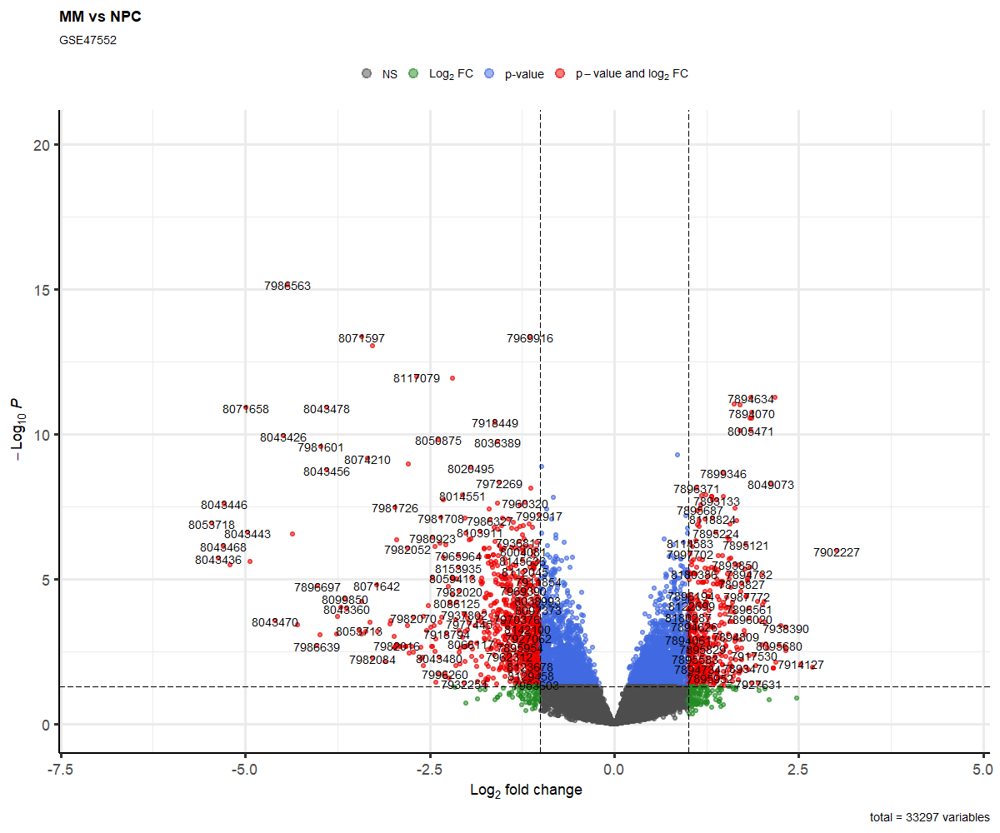
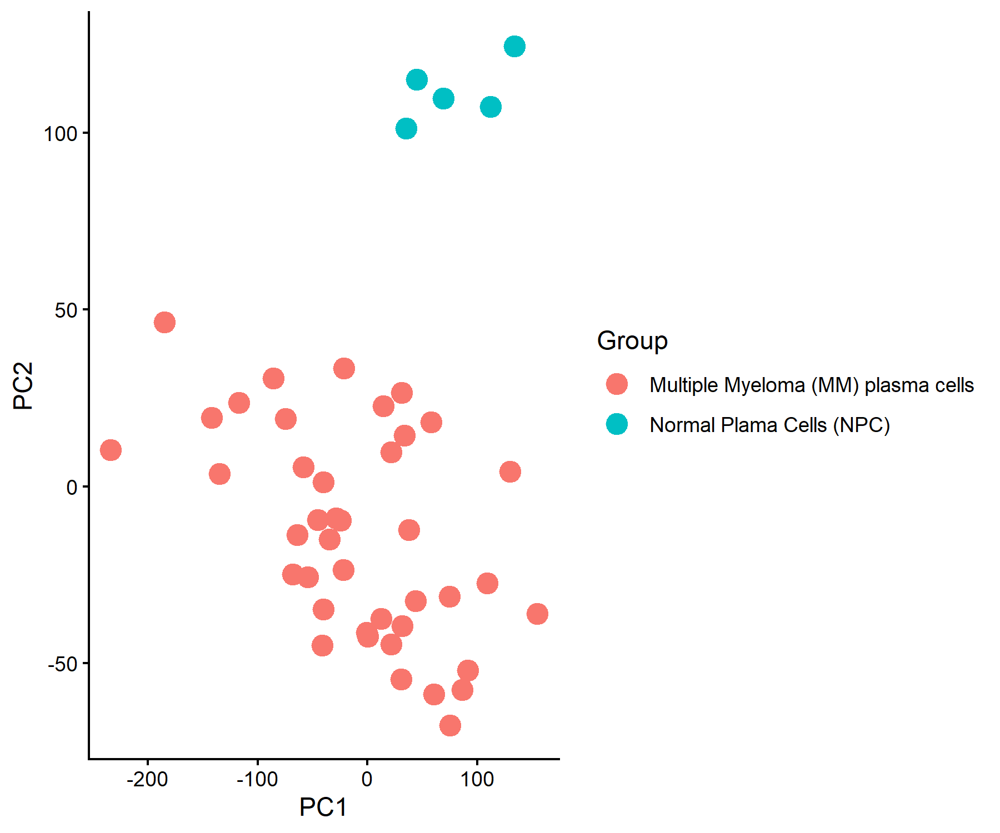
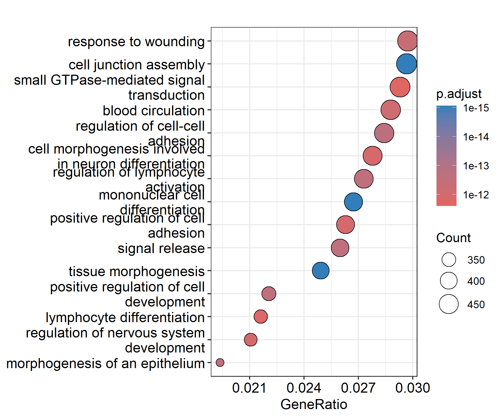
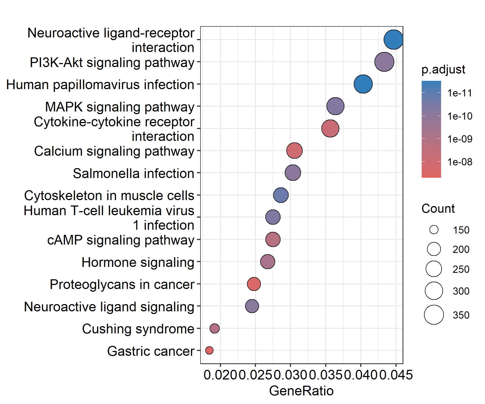

# GSE47552 Microarray Gene Expression Analysis

## Project Overview

This project analyzes the GSE47552 gene-expression dataset from the Gene Expression Omnibus (GEO).

The analysis focuses on differences in gene expression between Multiple Myeloma (MM) plasma cells and Normal Plasma Cells (NPC).

## Biological Question

The main objective is to identify genes that are dysregulated in Multiple Myeloma compared with normal plasma cells and to investigate the biological pathways associated with these changes.

## Dataset

- **GEO accession:** GSE47552
- **Data type:** Microarray gene-expression data
- **Comparison:** Multiple Myeloma (MM) vs Normal Plasma Cells (NPC)

The original dataset contains four biological groups:

- Monoclonal Gammopathy of Undetermined Significance (MGUS)
- Multiple Myeloma (MM)
- Normal Plasma Cells (NPC)
- Smoldering Multiple Myeloma (SMM)

For the differential-expression analysis, MM and NPC samples were selected.

## Analysis Pipeline

The analysis included:

1. Data acquisition using GEOquery
2. Examination of sample metadata
3. Selection of MM and NPC samples
4. Differential-expression analysis using limma
5. Volcano plot
6. Heatmap
7. Principal Component Analysis (PCA)
8. Gene Ontology (GO) enrichment
9. KEGG pathway enrichment
10. Biological interpretation of the significant genes and pathways

## Main Figures

### Volcano Plot

The volcano plot displays the magnitude and statistical significance of gene-expression changes between MM and NPC samples.



### Heatmap

The heatmap shows expression patterns of selected differentially expressed genes across the samples.


### PCA

PCA was used to examine the overall structure of the expression data and visualize separation between MM and NPC samples.




### GO Enrichment

Gene Ontology enrichment was used to identify biological processes associated with the differentially expressed genes.



### KEGG Enrichment

KEGG enrichment was used to identify biological pathways associated with the differentially expressed genes.



## Biological Interpretation

The differential-expression analysis identified genes that were significantly dysregulated between Multiple Myeloma and Normal Plasma Cells.

The identified genes were further examined in the context of enriched GO terms and KEGG pathways to understand their potential biological relevance to plasma-cell biology and Multiple Myeloma.

The top differentially expressed genes and enriched pathways were compared with findings reported in the original study to determine whether the present analysis showed biological patterns consistent with the published work.

A detailed interpretation is provided in:

`report/interpretation.md`

## Reproducibility

The main analysis code is provided in:

`deseq2analysis.R`

The complete analysis notebook is provided in:

`notebook/GSE47552_analysis.Rmd`

The project pipeline is provided in:

`pipeline.sh`

To reproduce the differential-expression analysis, run:

```bash
bash pipeline.sh

## Project Structure

```text
GSE47552-project/
│
├── README.md
├── deseq2analysis.R
├── pipeline.sh
│
├── notebook/
│   └── GSE47552_analysis.Rmd
│
├── report/
│   ├── methods.md
│   ├── results.md
│   └── interpretation.md
│
└── results/
    ├── volcano.png
    ├── heatmap.png
    ├── PCA.png
    ├── GO_dotplot.png
    └── KEGG_dotplot.png
    
 Software

The analysis was performed in R using packages including:

GEOquery
limma
ggplot2
pheatmap
clusterProfiler
org.Hs.eg.db
Reference

The original publication associated with GSE47552 is cited in the project report.   